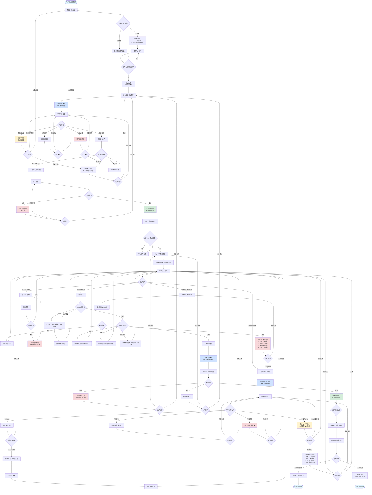

# 配网流程完整流程图

## 流程图说明

### 主要流程节点

1. **配网引导页面**
   - 显示设备开机指引
   - 提供开始配网按钮
   - 添加操作提示和帮助信息

2. **设备扫描阶段**
   - 扫描状态提示
   - 空状态处理（未找到设备）
   - 超时处理
   - 错误处理
   - 重新扫描功能

3. **设备绑定阶段**
   - 设备选择反馈
   - 绑定成功/失败处理
   - 重试机制

4. **WiFi配置阶段**
   - WiFi列表搜索（支持扫描状态、空状态、错误处理）
   - 手动输入WiFi名称（实时校验）
   - 密码输入校验
   - 输入完整性校验

5. **配网发送阶段**
   - 发送状态提示
   - 成功/失败/超时处理
   - 重试机制

### 异常情况处理

1. **信息缺失**
   - 添加步骤指示器
   - 添加操作提示
   - 添加帮助信息
   - 添加错误说明

2. **操作迷茫**
   - 明确的操作指引
   - 状态文字说明
   - 帮助信息提示
   - 下一步操作提示

3. **状态未知**
   - 扫描状态提示
   - 加载状态提示
   - 进度反馈
   - 状态文字说明

4. **行为无反馈**
   - 按钮点击反馈
   - 操作成功/失败提示
   - 错误信息提示
   - 动画效果反馈

### 关键校验点

1. **WiFi名称校验**
   - 不能为空
   - 长度1-32字符
   - 字符限制（中文、英文、数字、连字符、下划线、点号）
   - 不能全为空格
   - 实时校验和失焦校验

2. **WiFi密码校验**
   - 不能为空
   - 长度8-64字符
   - 提交时校验

3. **设备扫描校验**
   - 扫描超时处理
   - 扫描错误处理
   - 空结果处理

4. **配网发送校验**
   - 发送超时处理
   - 发送错误处理
   - 重试机制
